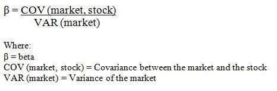
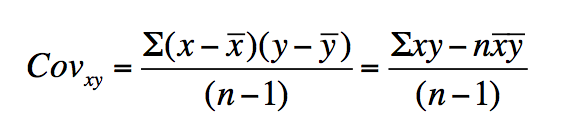
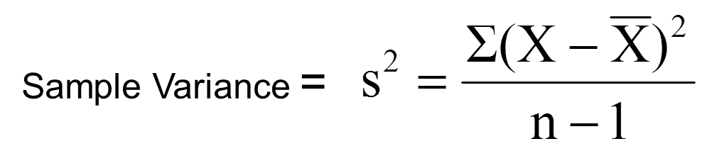
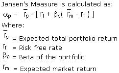
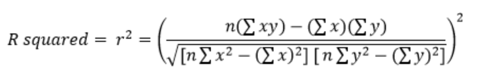
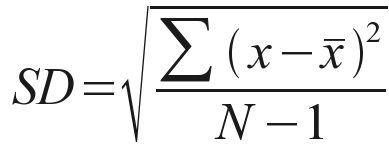
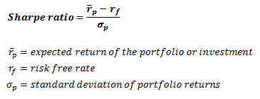

# Bull's Eye

Bulls’ Eye calculates five key historical measures of a vast array of securities; facilitating effective risk management within the domain of quantitative finance.

## Demo

## Program Features

Bulls’ Eye calculates the Beta, Alpha (Jensen’s Alpha), R-Squared, Standard Deviation, and Sharpe Ratio of a given security based on its data over 5 years. When calculating these measures, the program examines a security’s total returns (to account for dividends), however it is assumed that dividends are not reinvested. The following descriptions outline how this program calculates each historical measure:

### Beta

Beta is a historical measure used in fundamental analysis that helps assess the volatility of a security relative to the market.

SPY (The S&P 500) is often used as a benchmark index to gauge the performance of the general market, hence this program compares any given security to SPY’s performance. By default, SPY has a Beta of 1. If a stock moves less than the market over time, its Beta will be below 1. If a stock moves more than the market over time, its Beta will be greater than 1. Stocks with higher Beta’s pose a greater risk to an investor, but they also tend to provide greater returns.

This program analyzes a security’s 5Y Month-Over-Month data when determining its volatility relative to the market. The following is the equation that the program leverages:

To narrow things down further, the following are the equations used to calculate covariance and variance:

#### Covariance:

#### Variance:

Where:

- _x_ or _X_ represents the market's total returns.
- _y_ represents the security's total returns.
- _n_ represents the number of data points.

### Alpha (Jensen's Alpha)

Jensen’s Alpha is a risk-adjusted performance measure that utilizes a security’s Beta and the average market return to determine the security’s average return greater than or less than its projected returns as per the _Capital Asset Pricing Model_.

If a security’s Alpha is positive, the security is beating its projected returns based on its associated risk. If a security’s Alpha is negative, the security’s returns are below its projected returns based on its associated risk. For example, if a security’s Alpha is 3%, the security outperformed the market by 3% on a risk-adjusted basis.

This program analyzes a security’s 5Y Month-Over-Month data when determining its Alpha. The following is the equation that the program implements:

### R-Squared:

R-Squared is a statistical measure that deploys a regression model to explain the percentage of a security’s movement can be explained by movements in a benchmark index (i.e. SPY).

For example, if the R-Squared of a security is 0.75, then three-quarters of the security’s variation can be explained by the market’s variation. A security’s R-Squared is considered high if it ranges from 0.85-1.00, as this means the security’s movements align strongly with the benchmark’s index’s.

This program analyzes a security’s 5Y Month-Over-Month data when determining its R-Squared Value. The following is the equation that the program leverages:

Where:

- _x_ represents the market's total returns.
- _y_ represents the security's total returns.
- _n_ represents the number of data points.

### Standard Deviation:

Standard Deviation illustrates how a security’s returns vary in contrast to the security’s mean return.

Volatile stocks often have high standard deviations, while blue-chips companies have low standard deviations. The greater a security’s standard deviation, the more the security’s returns tend to sway from its mean returns, indicating greater risk (and greater earning potential). For example, if a security has a standard deviation of 25% over 5 years with the returns being examined year-by-year, the security’s returns would tend to vary 25% year-by-year when compared to its mean return.

This program analyzes a security’s 5Y Year-Over-Year data when determining its Standard Deviation. The following is the equation that the program leverages:

Where:

- _x_ represents the security's total returns.
- _N_ represents the number of data points.

### Sharpe Ratio:

A security’s Sharpe Ratio outlines the security’s average return earned in excess of the risk-free rate per unit of volatility. The risk-free rate of return is generally tied to the yield offered by U.S. Treasury Bills/Notes/Bonds. Moving forward, the security’s Standard Deviation illustrates its volatility, which is useful when calculating a security’s Sharpe Ratio.

A Sharpe Ratio that exceeds 1 indicates that the security’s returns are proportionately favourable when compared to its volatility. Sharpe Ratios that are greater than 2 or even greater than 3 are considered to be excellent. A Sharpe Ratio that falls below 1 indicates the security’s returns are proportionately unfavourable when compared to its volatility. A negative Sharpe Ratio either indicates that the Risk Free Rate of Return exceeds the security’s total returns or that the security’s total returns are negative.

This program analyzes a security’s 5Y Year-Over-Year data when determining its Sharpe Ratio. The program also uses the U.S. 5Y Treasury Note Yield when calculating the risk-free rate. The following is the equation that the program leverages:

## Running the Program

1. [Download Python 3.x](https://www.python.org/downloads/).
2. [Clone this repository](https://docs.github.com/en/github/creating-cloning-and-archiving-repositories/cloning-a-repository).
3. Install the package for [Alpha Vantage](https://github.com/RomelTorres/alpha_vantage). Next, install the package for [Quandl](https://github.com/quandl/quandl-python).
4. Obtain a free API key for [Alpha Vantage](https://www.alphavantage.co/support/#api-key) and [Quandl](https://www.quandl.com/sign-up).
5. Using your command line/terminal, navigate to the _bulls-eye_ directory and type `python3 prompt.py`.
